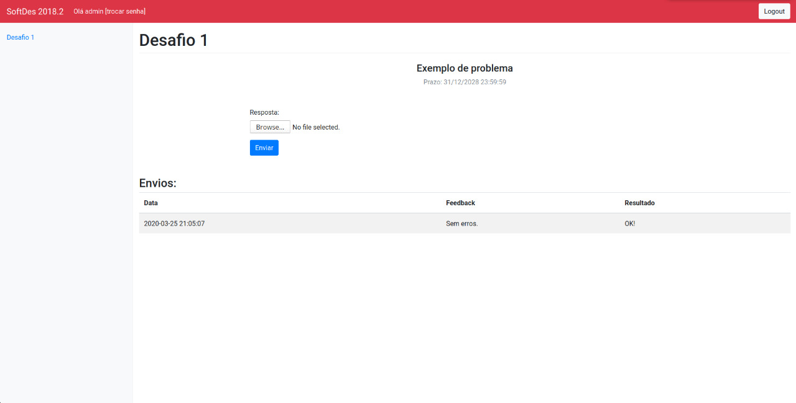

# Servidor de Desafios
This application is designed to be used as a support plataform for Design de Software

You can use this plataform as a continious feedback for your students, and to get some stats about how your class is going

## Getting started

First you need to download [this repo](https://github.com/brunoartc/desafios) and see the [dev guide](dev.md);

## User guides
- [Teachers](professor.md)
- [Students](students.md)
