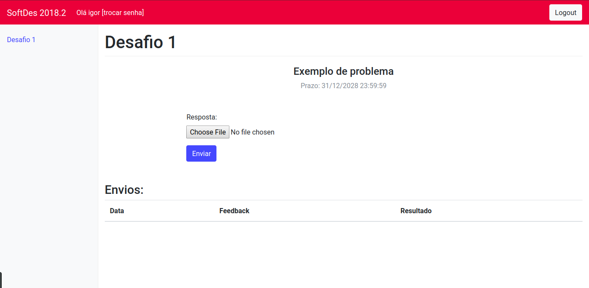
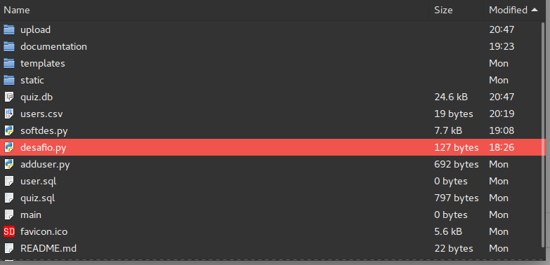

# Students User Guide

## Start Up

- Start a Desafios webserver [tutorial](dev.md "tutorial").
- After starting Desafios Flask webserver, goto url and use your login ans password then click sign in

## Sending a solution

- After Sign In you can click in the desired challenge and subbmit a solution

> select chose file and send your solution to the server 

- After sending the file you can check the feedback in "Envios" section, your solution will show OK if no error were found and your solution runs

## Wrong solution

- If your solution is considered wrong you can check again in Feedback session

